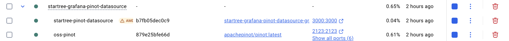
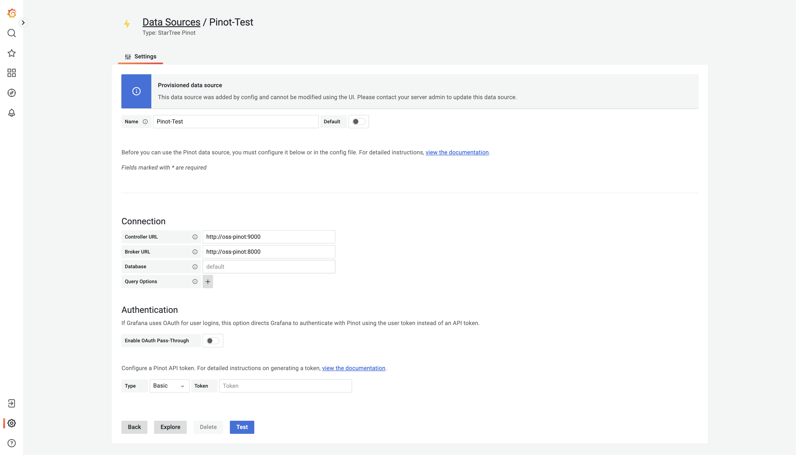

# Pinot Data Source Plugin for Grafana

The Pinot Data Source Plugin for Grafana enables you to visualize and query data from your Apache Pinot cluster directly within Grafana. Build powerful dashboards with time-series visualizations, tables, and more.

## Features

- 🎯 **Visual Query Builder** - Build queries without writing SQL
- 📊 **Multiple Visualization Types** - Support for time-series, tables, and logs
- 🔍 **Advanced Query Editor** - Write custom SQL queries with macro support
- 🔐 **Authentication** - Support for API tokens and OAuth pass-through
- 📈 **Variables & Annotations** - Full support for Grafana variables and annotations
- ⚡ **Performance** - Optimized for large-scale data queries

## System Requirements

- **Grafana:** Version 9.1.1 or higher
- **Apache Pinot:** Any version (optimized for latest releases)

## Installation

### From Grafana Marketplace

1. Navigate to **Configuration → Plugins** in your Grafana instance
2. Search for "Pinot" or "StartTree"
3. Click **Install** on the Pinot data source plugin

### Local Installation with Docker

For local development and testing using Docker, refer to the [Testing Guide](TESTING.md).

## Configuration

To configure the Pinot data source in Grafana:

1. Navigate to **Configuration → Data Sources**
2. Click **Add data source**
3. Select **Pinot** from the list
4. Configure the following:
   - **Controller URL** - Your Pinot controller endpoint (e.g., `http://localhost:9000`)
   - **Broker URL** - Your Pinot broker endpoint (e.g., `http://localhost:8000`)
   - **Database** (optional) - Default database name
   - **Authentication** - API token if required

For detailed configuration instructions, query builders, macros, and advanced features, see the [Plugin Usage & Features Guide](src/README.md).

## Quick Start

1. **Install the plugin** from the Grafana marketplace or locally
2. **Configure a data source** with your Pinot cluster details
3. **Create a dashboard** and add a new panel
4. **Select Pinot as the data source** and choose your query type:
   - Use the **Builder** for visual query construction
   - Use the **Code Editor** for custom SQL queries
5. **Visualize your data** with Grafana's powerful visualization options

## Documentation

### User Guides
- **[Plugin Usage & Features](src/README.md)** - Complete guide on using the plugin, including query builders, macros, and visualization options

### Developer Guides
- **[Development Guide](DEVELOPMENT.md)** - Setup instructions for local development, testing, and contributing
- **[Testing Guide](TESTING.md)** - Step-by-step instructions for testing the plugin locally with OSS Pinot

## Support

- **Issues:** Report bugs and request features on [GitHub Issues](https://github.com/startreedata/startree-grafana-pinot-datasource/issues)
- **Documentation:** [Apache Pinot Documentation](https://docs.pinot.apache.org/)
- **Architecture:** [System & Code Architecture](https://docs.google.com/document/d/1gCoF0MN8wQfD-Lq-wq2SagTavRcU4iO1drueCj4XA6M/edit?tab=t.0#heading=h.hx07umlqsfwe)

## Contributing

We welcome contributions! Please see the [Development Guide](DEVELOPMENT.md) for information on setting up your development environment and submitting pull requests.

## License

See [LICENSE](LICENSE) file for details.

