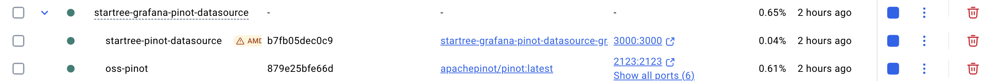
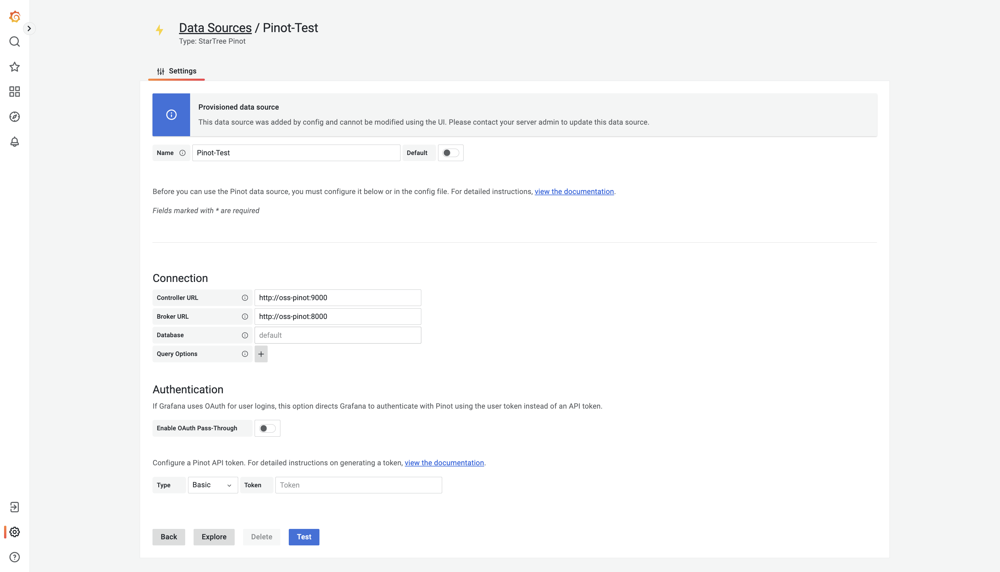
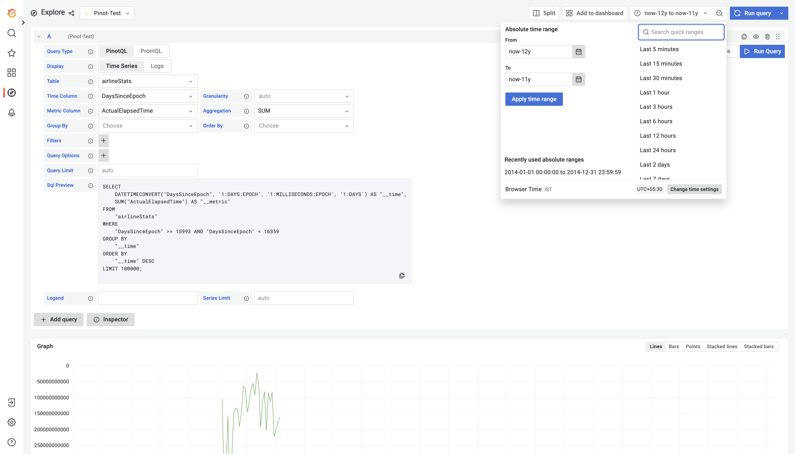

# Testing Guide

## Prerequisites
- Docker and Docker Compose installed

## Steps to Test the Plugin

### 1. Start OSS Pinot and Grafana

Start the OSS Pinot instance and Grafana using Docker Compose:

```bash
docker-compose up oss-pinot grafana
```

Wait for both services to start completely.




### 2. Access Grafana

Open your browser and navigate to:
```
http://localhost:3000
```

### 3. Configure and Test the Datasource

Navigate to the datasources page:
```
http://localhost:3000/datasources
```

You should see a pre-configured datasource named **Pinot-Test** with the following settings:
- Controller URL: `http://oss-pinot:9000`
- Broker URL: `http://oss-pinot:8000`




Click the **Test** button to verify the connection to Pinot.

### 4. Explore Data

1. Click the **Explore** button (or navigate to the Explore page)
2. In the query builder:
   - **Table**: Select `airlineStats` from the dropdown
   - **Time Column**: Choose the appropriate time column
   - **Metric Column**: Choose a metric to visualize

### 5. Set Time Range

Click on the time range selector in the top right corner and set:
- **From**: `now-12y`
- **To**: `now-11y`



Click **Apply time range** to update the query.

### 6. Run Query

The query should execute and display historical airline statistics data from the specified time range.

## Adding Your Own Table and Data

If you want to test the plugin with your own custom tables and data, follow these steps:

### 1. Access Pinot Console

Navigate to the Pinot Controller UI:
```
http://localhost:9000
```

### 2. Prepare Your Schema

Create a schema JSON file that defines your table structure. Example:

```json
{
  "schemaName": "myTable",
  "dimensionFieldSpecs": [
    {
      "name": "userId",
      "dataType": "STRING"
    },
    {
      "name": "country",
      "dataType": "STRING"
    }
  ],
  "metricFieldSpecs": [
    {
      "name": "viewCount",
      "dataType": "INT"
    }
  ],
  "dateTimeFieldSpecs": [
    {
      "name": "timestamp",
      "dataType": "LONG",
      "format": "1:MILLISECONDS:EPOCH",
      "granularity": "1:MILLISECONDS"
    }
  ]
}
```

### 3. Create Table Configuration

Create a table config JSON file. Example for offline table:

```json
{
  "tableName": "myTable",
  "tableType": "OFFLINE",
  "segmentsConfig": {
    "replication": "1"
  },
  "tenants": {
    "broker": "DefaultTenant",
    "server": "DefaultTenant"
  },
  "tableIndexConfig": {
    "loadMode": "MMAP"
  },
  "ingestionConfig": {
    "batchIngestionConfig": {
      "segmentIngestionType": "APPEND",
      "segmentIngestionFrequency": "DAILY"
    }
  }
}
```

### 4. Add Schema and Table via Pinot Console

1. Go to the **Query Console** tab in Pinot UI
2. Use the REST API or web interface to add your schema
3. Create the table using your table configuration
4. Ingest your data using one of Pinot's ingestion methods

### 5. Verify in Grafana

1. Return to Grafana Explore view
2. Your new table should now appear in the **Table** dropdown
3. Select appropriate time and metric columns
4. Run queries against your custom data

For detailed instructions on table creation, ingestion methods, and advanced configurations, refer to the official Apache Pinot documentation:
- [Create and Update Table Config](https://docs.pinot.apache.org/basics/getting-started/create-and-update-table-config)
- [Batch Ingestion](https://docs.pinot.apache.org/basics/data-import/batch-ingestion)
- [Stream Ingestion](https://docs.pinot.apache.org/basics/data-import/pinot-stream-ingestion)

## Troubleshooting

- If Pinot is not accessible, ensure the containers are running: `docker ps`
- Check container logs: `docker-compose logs oss-pinot` or `docker-compose logs grafana`
- Ensure ports 3000, 8000, and 9000 are not already in use
